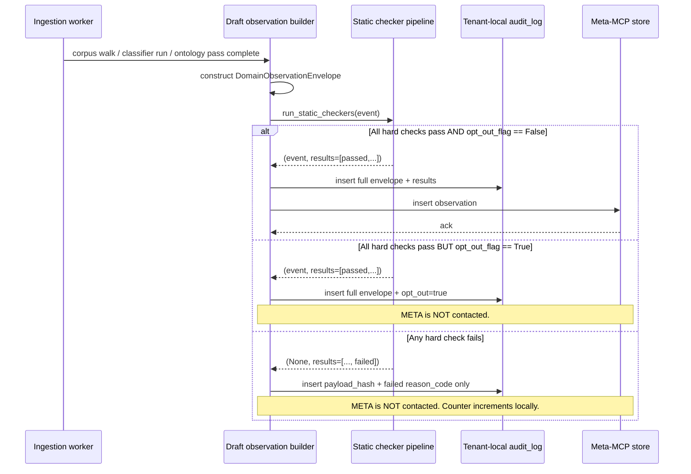

# `DomainObservation` — wire format for the tenant→meta-MCP boundary (v1)

**Status:** Architect's draft (M1-MCP-01). Pending review by the MCP-builder (consumer of this contract) and the Ingestion engineer (producer of this contract).

**Ticket:** `M1-MCP-01`. Sibling: `M1-MCP-01a` (pre-emit static checkers — sketched here, full implementation owned by that ticket).

**Stack:** Python 3.12, Pydantic 2.9, Postgres 16. See `docs/architecture/stack.md`.

---

## 1. Purpose & scope

### 1.1 What this is

A `DomainObservation` is the **only** kind of event allowed to cross from a tenant's ingestion process into the meta-MCP layer. It is the wire format for the cross-tenant boundary described in `DECISIONS.md` (2026-05-22 — Meta-MCP cross-tenant boundary).

Per that decision, the boundary is a **content-vs-pattern split**:

- **MUST NOT cross (CONTENT — customer property):** customer-specific names (people, projects, codenames, products, vendors), figures and numeric values, file names, file paths, file content excerpts, quotes verbatim or near-verbatim.
- **MAY cross (PRINCIPLE — generalizable knowledge):** naming conventions, syntax patterns, organizational structures, data relationships, procedures, statistical aggregates that don't expose identifying figures, other generally applicable shape information.

Every field on every payload in this document is classified as **PRINCIPLE**, **CONTENT** (must be redacted before emit; should never be a field on the emitted object), or **METADATA** (system-level, not subject to the content/principle taxonomy — e.g., event id, timestamp).

### 1.2 Who emits

The ingestion service (`services/ingestion/`) emits `DomainObservation` events at well-defined moments:

- After a successful corpus walk (ontology + document-type distribution observations)
- After a classifier run with non-trivial uncertainty (uncertainty observation)
- After an ontology induction pass (relationship-schema, ontology-shape observations)
- After a query-driven re-index trigger fires (query-pattern-shape observation)
- After an ingestion pipeline completes (pipeline-metrics observation)

### 1.3 Who consumes

The meta-MCP signature collector (`services/meta-mcp/`, ticket `M1-MCP-02`) is the consumer. Events are persisted in the **meta-tenant store** (separate Postgres database — see `v1.md` §2). Per decision, the meta store contains no `tenant_id` foreign key and no field linking back to customer identity beyond the `tenant_anon_id` described below.

### 1.4 Where events flow

`ingestion worker` → **pre-emit static checkers (`M1-MCP-01a`)** → either (a) the tenant's local `audit_log` table + the meta store, or (b) the tenant's local `audit_log` only, marked `rejected_by_checker`. The event never leaves the tenant boundary if any checker fires.

### 1.5 Transport

Events cross the boundary as JSON over an in-process function call in M1 (the meta-MCP runs in the same Python process as the ingestion service in M1, per `v1.md` §1). They will become a real HTTP POST when the meta-MCP splits out post-M2. The schema is identical either way — the JSON is the source of truth.

---

## 2. Event envelope

The envelope is common to all payload variants. Every field here is **METADATA** unless otherwise noted.

```python
from __future__ import annotations
from datetime import datetime
from typing import Literal, Annotated, Union
from uuid import UUID
from pydantic import BaseModel, ConfigDict, Field, AwareDatetime


SCHEMA_VERSION = "1.0.0"


class DomainObservationEnvelope(BaseModel):
    """Wire-format envelope for the tenant->meta-MCP boundary.

    Every cross-boundary event in versawiki is exactly one of these.
    No field on this envelope or its payload may contain customer
    CONTENT per `DECISIONS.md` (2026-05-22 boundary decision).
    """

    model_config = ConfigDict(
        extra="forbid",                # unknown fields are a hard reject
        frozen=True,                   # events are immutable post-construction
        str_strip_whitespace=True,
        validate_default=True,
    )

    # ---- Identity & versioning ----
    event_id: UUID                                          # METADATA
    schema_version: Literal["1.0.0"] = SCHEMA_VERSION       # METADATA
    observed_at_utc: AwareDatetime                          # METADATA

    # ---- Anonymous tenant correlation ----
    tenant_anon_id: str = Field(min_length=22, max_length=64)  # METADATA — see §2.1
    opt_out_flag: bool = False                              # METADATA — see §2.2

    # ---- Domain grouping ----
    domain_signature_id: UUID | None = None                 # METADATA
    # `domain_signature_id` is null on the first observation from a tenant
    # whose signature hasn't been computed yet; the signature collector
    # backfills it on insert. Subsequent observations from the same tenant
    # carry the id so the meta layer can correlate without re-clustering.

    # ---- Payload ----
    payload: "DomainObservationPayload"                     # see §3 — discriminated union
```

### 2.1 `tenant_anon_id` design

**Requirement.** The meta-MCP must be able to correlate observations from the same tenant **without** that string being a customer identifier and without being reversible to one.

**Decision (Architect's recommendation; flag #1 to Josh in §8).** Use a UUIDv4 issued at tenant provisioning and stored only in the tenant's own `vw_<slug>` schema (column `tenants.anon_id`). The meta layer sees the UUID; the mapping `anon_id → tenant_id` lives only in the tenant's own schema.

**Rejected alternative: HMAC of `tenant_id` under a rotating key.** Attractive because rotation would let us invalidate correlation after a window. Rejected because the meta layer's whole job is *longitudinal* observation across many ingestion runs from the same tenant; rotating the key would either lose history or require re-emitting historical observations under the new key, which is a re-export of customer-derived data — exactly the thing we want to avoid.

**Properties of the chosen design:**

- One-way at the meta boundary by construction (no key to reverse; the mapping is locked inside the tenant schema).
- Correlation across observations is preserved indefinitely.
- A tenant deletion (`DROP SCHEMA vw_acme CASCADE`) destroys the only `anon_id → tenant_id` mapping in existence — at that point the meta layer is left with historical anon-id rows that point to nothing, which is the correct state.
- Opt-out (see `opt_out_flag` and ticket `M1-MCP-05`) is independent of this design — a tenant who opts out simply emits no observations at all.

### 2.2 `opt_out_flag`

If `true`, the event MUST be dropped before insertion into the meta store. It is still written to the tenant-local `audit_log` so the tenant can verify their opt-out is being honored. The flag exists on the envelope rather than as a side-channel because it lets the static checkers and the meta-MCP independently enforce opt-out without consulting a separate config service. (Defense in depth.)

The full opt-out behavior — including how a tenant flips this flag and how `M1-MCP-04` skill applier respects it — is owned by `M1-MCP-05`.

---

## 3. Payload variants

Eight variants in v1. All share the discriminated-union pattern below; the `kind` field is the discriminator.

```python
DomainObservationPayload = Annotated[
    Union[
        "OntologyShape",
        "NamingConvention",
        "DocumentTypeDistribution",
        "RelationshipSchema",
        "ProcedurePattern",
        "QueryPatternShape",
        "ClassifierUncertainty",
        "IngestionPipelineMetrics",
    ],
    Field(discriminator="kind"),
]
```

A note on numeric values. Several payloads carry counts and quantiles. Per decision, **statistical aggregates that don't expose identifying figures may cross**; raw figures may not. The rule we apply throughout: **all numeric values in payloads must be either (a) integer counts of structural categories with ≥3 underlying samples, (b) ratios/percentages, or (c) low-resolution histograms/quantiles**. No raw money values, headcounts, measurements, sheet numbers, etc., ever. The static checkers (§5) enforce this with a numeric-pattern detector.

### 3.1 `OntologyShape`

```python
class OntologyShape(BaseModel):
    model_config = ConfigDict(extra="forbid", frozen=True)

    kind: Literal["ontology_shape"] = "ontology_shape"

    depth: int                                # PRINCIPLE — tree depth (small int)
    node_count_bucket: Literal[                # PRINCIPLE — bucketed to avoid figure leak
        "1-10", "11-50", "51-200", "201-1000", "1000+"
    ]
    branching_factor_p50: float                # PRINCIPLE — median branching
    branching_factor_p95: float                # PRINCIPLE
    leaf_to_internal_ratio: float              # PRINCIPLE
    kind_distribution: dict[                   # PRINCIPLE — counts by ontology node kind
        Literal["category", "entity", "topic"], int
    ]
    induced_vs_seed_ratio: float | None        # PRINCIPLE — how much of the ontology
                                               # came from LLM induction vs. seed taxonomy
    # FORBIDDEN here: any node labels, any tenant slug, any document title.
```

### 3.2 `NamingConvention`

```python
class NamingConvention(BaseModel):
    model_config = ConfigDict(extra="forbid", frozen=True)

    kind: Literal["naming_convention"] = "naming_convention"

    # What "thing" the convention applies to, in generic terms only.
    applies_to: Literal[
        "document_id", "drawing_number", "spec_section",
        "rfi_id", "submittal_id", "other_identifier"
    ]                                          # PRINCIPLE

    # The convention itself, expressed as a regex-shaped template using
    # *role tokens* not example strings. E.g. "<phase>-<discipline>-<sequence>".
    # Tokens are drawn from a fixed vocabulary; arbitrary literals are forbidden.
    template: str = Field(pattern=r"^[<>a-z\-_]+$")    # PRINCIPLE

    token_vocabulary: list[Literal[            # PRINCIPLE — fixed enum, no free text
        "phase", "discipline", "sequence", "revision", "date_yyyymmdd",
        "date_yyyymm", "type_code", "subtype_code", "version", "lot",
        "drawing_set", "rfi_round", "other"
    ]]

    sample_count_bucket: Literal[              # PRINCIPLE — how strong the signal is
        "3-10", "11-50", "51-200", "200+"
    ]
    adherence_rate: float                      # PRINCIPLE — fraction matching the template

    # FORBIDDEN here: actual example strings ("DD-ELE-001"), specific token
    # values ("DD", "ELE", "001"), file names. The whole point is the template
    # crosses, not the populated identifiers.
```

### 3.3 `DocumentTypeDistribution`

```python
class DocumentTypeDistribution(BaseModel):
    model_config = ConfigDict(extra="forbid", frozen=True)

    kind: Literal["document_type_distribution"] = "document_type_distribution"

    # Distribution of *type labels from a controlled vocabulary*, not the
    # tenant's own labels. The classifier produces a tenant-side label and
    # also a coarse-grained "generic_type" from a fixed enum; only the
    # generic type crosses.
    generic_type_counts: dict[Literal[         # PRINCIPLE — bucketed counts
        "drawing", "specification", "rfi", "submittal",
        "meeting_minutes", "report", "calculation",
        "contract", "correspondence", "schedule",
        "image", "spreadsheet", "presentation", "other"
    ], Literal["0", "1-10", "11-50", "51-200", "201-1000", "1000+"]]

    total_documents_bucket: Literal[           # PRINCIPLE — bucketed total
        "1-10", "11-50", "51-200", "201-1000", "1001-10000", "10000+"
    ]

    classifier_confidence_p50: float           # PRINCIPLE
    classifier_confidence_p10: float           # PRINCIPLE — low-tail signal

    # FORBIDDEN here: raw counts of any single type, tenant-side type labels,
    # any document titles or sample text.
```

### 3.4 `RelationshipSchema`

```python
class RelationshipSchema(BaseModel):
    model_config = ConfigDict(extra="forbid", frozen=True)

    kind: Literal["relationship_schema"] = "relationship_schema"

    # Each edge is a (source generic_type, target generic_type, relation kind).
    # Both endpoints draw from the same controlled vocabulary as above.
    edges: list["RelationshipEdge"]            # PRINCIPLE — see below


class RelationshipEdge(BaseModel):
    model_config = ConfigDict(extra="forbid", frozen=True)

    source_type: Literal[                      # PRINCIPLE — fixed enum
        "drawing", "specification", "rfi", "submittal",
        "meeting_minutes", "report", "calculation",
        "contract", "correspondence", "schedule", "other"
    ]
    target_type: Literal[
        "drawing", "specification", "rfi", "submittal",
        "meeting_minutes", "report", "calculation",
        "contract", "correspondence", "schedule", "other"
    ]                                          # PRINCIPLE
    relation: Literal[                         # PRINCIPLE — fixed enum
        "references", "supersedes", "responds_to", "approves",
        "schedules", "summarizes", "computes_for", "annotates"
    ]
    detection_method: Literal[                 # PRINCIPLE
        "label_pattern", "embedding_proximity", "explicit_field", "llm_extraction"
    ]
    edge_count_bucket: Literal[                # PRINCIPLE — how many such edges
        "1-10", "11-100", "101-1000", "1000+"
    ]
    confidence_p50: float                      # PRINCIPLE

    # FORBIDDEN: specific source/target identifiers, instance counts that
    # could reveal corpus size precisely, free-text relation labels.
```

### 3.5 `ProcedurePattern`

```python
class ProcedurePattern(BaseModel):
    model_config = ConfigDict(extra="forbid", frozen=True)

    kind: Literal["procedure_pattern"] = "procedure_pattern"

    # A lifecycle observed across documents of a given generic type, expressed
    # as an ordered list of state tokens from a controlled vocabulary.
    applies_to_type: Literal[                  # PRINCIPLE
        "drawing", "specification", "rfi", "submittal",
        "report", "calculation", "other"
    ]
    states: list[Literal[                      # PRINCIPLE — fixed enum of states
        "draft", "in_review", "reviewed", "issued_for_information",
        "issued_for_bid", "issued_for_construction", "as_built",
        "open", "responded", "closed", "approved", "rejected",
        "superseded", "void", "record", "other"
    ]]
    transitions_observed_bucket: Literal[      # PRINCIPLE — strength of signal
        "1-10", "11-100", "101-1000", "1000+"
    ]
    median_lifecycle_states: int               # PRINCIPLE — typically <= 6
    detection_method: Literal[                 # PRINCIPLE
        "revision_metadata", "filename_token", "llm_extraction", "explicit_field"
    ]

    # FORBIDDEN: time durations between states (could approximate project size),
    # actual revision strings, document titles.
```

### 3.6 `QueryPatternShape`

```python
class QueryPatternShape(BaseModel):
    model_config = ConfigDict(extra="forbid", frozen=True)

    kind: Literal["query_pattern_shape"] = "query_pattern_shape"

    # A canonicalized *shape* of recurring queries, with all entities and
    # specifics replaced by role tokens. E.g. "find <type> by <identifier_kind>"
    # not "find drawing E-101".
    shape_template: str = Field(pattern=r"^[<>a-z\-_ ]+$")   # PRINCIPLE

    token_vocabulary: list[Literal[
        "type", "identifier_kind", "topic", "phase",
        "discipline", "date_range", "status", "other"
    ]]                                         # PRINCIPLE

    occurrence_count_bucket: Literal[          # PRINCIPLE
        "3-10", "11-50", "51-200", "200+"
    ]
    caller_kind: Literal["human", "mcp", "mixed"]   # PRINCIPLE

    # FORBIDDEN: actual query strings, even paraphrased; any embedded entity
    # names; result counts; latency from this customer's traffic.
```

### 3.7 `ClassifierUncertainty`

```python
class ClassifierUncertainty(BaseModel):
    model_config = ConfigDict(extra="forbid", frozen=True)

    kind: Literal["classifier_uncertainty"] = "classifier_uncertainty"

    # Where the classifier is failing or hesitant, expressed by generic types,
    # never by individual documents.
    uncertain_pairs: list["UncertainPair"]     # PRINCIPLE
    overall_confidence_p10: float              # PRINCIPLE
    sampled_documents_bucket: Literal[
        "1-10", "11-100", "101-1000", "1000+"
    ]                                          # PRINCIPLE


class UncertainPair(BaseModel):
    model_config = ConfigDict(extra="forbid", frozen=True)

    type_a: Literal[                           # PRINCIPLE
        "drawing", "specification", "rfi", "submittal",
        "meeting_minutes", "report", "calculation",
        "contract", "correspondence", "schedule", "other"
    ]
    type_b: Literal[
        "drawing", "specification", "rfi", "submittal",
        "meeting_minutes", "report", "calculation",
        "contract", "correspondence", "schedule", "other"
    ]
    confusion_rate: float                      # PRINCIPLE

    # FORBIDDEN: specific document IDs, file names, snippets of confusing text,
    # the actual misclassified labels (tenant-side).
```

### 3.8 `IngestionPipelineMetrics`

```python
class IngestionPipelineMetrics(BaseModel):
    model_config = ConfigDict(extra="forbid", frozen=True)

    kind: Literal["ingestion_pipeline_metrics"] = "ingestion_pipeline_metrics"

    # Pipeline performance shape, useful for the meta-MCP to learn which
    # ingestion strategies pay off for which domain signatures.
    chunker_strategy: Literal[                 # PRINCIPLE
        "fixed_token", "semantic", "structural", "hybrid"
    ]
    embedding_provider_family: Literal[        # PRINCIPLE
        "openai", "bge", "voyage", "nomic", "other"
    ]
    embedding_dim: Literal[1024]               # PRINCIPLE — schema-locked, see DECISIONS

    docs_processed_bucket: Literal[
        "1-10", "11-100", "101-1000", "1000+"
    ]                                          # PRINCIPLE
    chunks_per_doc_p50: int                    # PRINCIPLE
    chunks_per_doc_p95: int                    # PRINCIPLE
    classification_failure_rate: float         # PRINCIPLE
    ontology_assignment_failure_rate: float    # PRINCIPLE

    # FORBIDDEN: wall-clock duration of this run (proxy for corpus size +
    # infra), tenant-specific worker counts, actual document hashes,
    # per-document timings.
```

---

## 4. Forbidden fields

Across **every** payload variant, the following are forbidden by construction (not optional, not "redact-if-present" — the schema must not allow them to exist):

| Forbidden | Why | Where you'd be tempted to put it |
|---|---|---|
| `raw_text`, `excerpt`, `snippet`, `body`, `content` (any free-text field that could carry customer text) | Direct content leak | "just one example" in any classifier-uncertainty payload |
| `file_path`, `file_name`, `source_uri`, `blob_key`, `path` | File identifiers are CONTENT under the boundary decision | Anywhere a "for context" field is tempting |
| `tenant_slug`, `tenant_name`, `display_name`, `customer_name`, `project_name`, `org_name`, `vendor_name`, `person_name`, `email`, `phone` | Customer identity, directly or by combination | Any "label" or "title" field |
| `count`, `total`, `revenue`, `value`, `amount`, `headcount`, `quantity`, `measurement_*`, `dim_*` (raw scalar numerics that aren't bucketed) | Raw figures are CONTENT under the boundary decision | "Just the count of RFIs", "just the total documents", "average sheet count per project" |
| `title`, `name`, `label`, `description` carrying free-form strings | Almost always tenant content | Ontology node labels, document type names |
| `query_text`, `query`, `q` | Queries can embed entities | Anywhere a `QueryPatternShape` example feels useful |
| Any `list[str]` of free-form strings | Free strings are a redaction nightmare | "Top 10 topics", "common phrases" |
| `timestamp` for anything but `observed_at_utc` on the envelope | Per-event/per-document timestamps approximate workload size and project pacing — both CONTENT | "When was this document ingested?" |

**Rule of thumb:** if a field's type is `str` and its values come from anywhere other than (a) a `Literal[...]` fixed vocabulary, (b) a regex-constrained template with role tokens only, or (c) a UUID/timestamp, **the field is forbidden until proven safe.**

---

## 5. Pre-emit static-checker pipeline

Full implementation is `M1-MCP-01a`. The sketch here is specific enough that the MCP-builder can wire it up without further design.

### 5.1 Checker signature

```python
from typing import Protocol


class CheckerResult(BaseModel):
    model_config = ConfigDict(extra="forbid", frozen=True)
    passed: bool
    reason_code: str | None = None         # e.g. "PII_PERSON_NAME"
    details: str | None = None             # safe-to-log description; no event data


class StaticChecker(Protocol):
    name: str
    severity: Literal["hard_reject", "soft_warn"]

    def check(self, event: DomainObservationEnvelope) -> CheckerResult:
        ...


def run_static_checkers(
    event: DomainObservationEnvelope,
    checkers: list[StaticChecker],
) -> tuple[DomainObservationEnvelope | None, list[CheckerResult]]:
    """
    Returns:
      (event, results) if all hard checkers pass.
      (None, results)  if any hard checker fails — caller MUST NOT emit.
    """
    ...
```

### 5.2 Order of checks (hard-reject in this order; first failure short-circuits)

1. **Schema validation** (cheapest, runs first). Pydantic `model_validate` with `extra="forbid"`. Any unknown field is a hard reject.
2. **Forbidden-field-name detector.** Scans the serialized JSON for keys matching the §4 blocklist anywhere in the tree (defense against future schema drift / a misconfigured payload subclass).
3. **PII / NER pass.** Run a NER model (spaCy `en_core_web_trf` plus a regex layer for emails, phones, URLs) against every string-typed value in the payload. Any `PERSON`, `ORG`, `GPE`, `EMAIL`, `PHONE`, `URL` hit is a hard reject. Allowed: matches against the controlled `Literal` vocabularies (whitelisted by exact-string match).
4. **Numeric-pattern detector.** For every numeric-typed leaf, confirm it satisfies the bucket/ratio/quantile constraint (must come from a `Literal` bucket enum, OR be a float in `[0.0, 1.0]`, OR be an integer < 1000 that the schema marks as "structural count"). Raw scalars outside this band — hard reject.
5. **Quote / near-quote detector.** For every string-typed value (after the `Literal` whitelist), compute trigram shingles. Reject if any string is longer than 64 characters OR if the trigram set overlaps >30% with content from the tenant's recent document corpus (this requires the checker to query the tenant's local chunk store; that query stays inside the tenant). This catches the case where a model accidentally serialized a sentence from a document into a field.
6. **Opt-out gate.** If `envelope.opt_out_flag == True`, treat as a hard reject for meta-store insertion (but still write to tenant-local audit log).

### 5.3 What happens on a check failure

- The event is **not** emitted to the meta-MCP.
- A record is written to the **tenant-local** `audit_log` table (in `vw_<slug>.audit_log`) with: `event_id`, `observed_at_utc`, `checker_name`, `reason_code`, `details`, and the offending event **payload hash only** (sha256, not the payload itself).
- A counter increments in tenant-local metrics so we can dashboard "rejected observations per tenant per checker" without leaking content to the meta layer.
- The ingestion worker continues — a single rejected observation does not fail the ingestion run.

### 5.4 What happens on success

- The event is written to the tenant-local `audit_log` (full envelope, since it's already been deemed safe), then to the meta store.
- If `opt_out_flag == True`, only the audit log write happens.

---

## 6. Event flow



---

## 7. Versioning

### 7.1 `schema_version` semantics

`schema_version` is SemVer: `MAJOR.MINOR.PATCH`.

- **PATCH** — clarifying changes to field docstrings, additional `Literal` members in a non-breaking position (i.e., the meta-MCP collector treats unknown enum members as `"other"`), bug fixes in the checkers that don't change accepted/rejected sets.
- **MINOR** — new optional fields on existing payload variants, new payload variants added to the discriminated union, new `Literal` members added to a controlled vocabulary in a way that requires consumer awareness. Old envelopes still parse.
- **MAJOR** — field renames, type changes, removal of payload variants, removal or narrowing of `Literal` members, change to envelope identity fields, change to the privacy taxonomy (forbidden-field list expansion is MINOR; narrowing it is MAJOR because it loosens the contract a customer relied on).

### 7.2 Backward compatibility

- The meta-MCP collector accepts envelopes whose `schema_version` is `>= 1.0.0` and `< 2.0.0`. Any envelope outside that range is rejected at the meta boundary (a v2 producer must wait until the consumer has been upgraded; a v1 producer keeps working after a 1.x bump to the consumer).
- Producers (ingestion workers) emit at exactly one version per release. We do not multiplex versions out of one worker.
- The migration story for a MAJOR bump is: deploy a translator on the meta-MCP side that reads v1 envelopes from the audit log and re-emits them as v2 events. Customer content is never re-exported; only the meta layer's already-anonymized history is reshaped.

### 7.3 Deprecation policy

A field marked `Deprecated` in v1.x continues to be accepted until the next MAJOR. The collector logs deprecated-field usage so we can confirm zero usage before the MAJOR bump.

---

## 8. Open questions for Josh

These are flagged per the escalation rule from `AGENTS.md` — each carries day-or-two rework stakes. Each has my recommendation.

1. **`tenant_anon_id` design — UUID-at-provisioning vs. HMAC-with-rotating-key.** Picked above. **Recommendation:** UUID-at-provisioning. Confirm? The alternative (HMAC + rotation) breaks longitudinal correlation, which is the meta layer's reason for existing. The cost of UUID is that we cannot retroactively "un-correlate" a tenant's history at the meta layer except by deleting all their meta rows — which is a feature, not a bug.

2. **Where does the controlled vocabulary for `generic_type` / `relation` / etc. live?** The Literals in §3 are baked into the Pydantic schema today. Two extension paths:
   - (a) bumping a MINOR version every time a new vocabulary member is needed, OR
   - (b) maintaining a separate `vocabulary.yaml` that the schema references at runtime, with its own version pin.

   **Recommendation:** (a) for v1 — version-everything-in-schema. (b) buys flexibility we don't yet need and adds an out-of-band moving part. Revisit at M3 if vocabulary churn becomes a chore.

3. **Numeric buckets vs. differential privacy.** Today we bucket counts (e.g., `"51-200"`) to avoid figure leak. A more rigorous alternative is differential-privacy noise on raw counts. **Recommendation:** stay with buckets for v1. DP adds calibration work and is overkill given the meta layer's coarse use of these numbers. We can layer DP on top later without changing the wire format (just narrow the bucket sizes or replace bucket strings with DP-noised counts in a v2).

4. **Should `tenant_anon_id` be on the envelope at all?** A purist view: if we want zero-correlation across observations from the same tenant, we drop the field entirely and the meta layer treats every observation as anonymous. **Recommendation:** keep it. Without correlation, the meta layer can't tell whether the same domain pattern is recurring across many tenants or just oscillating in one — that distinction is exactly what triggers the "write a skill" decision in `M1-MCP-03`. The privacy story remains intact because the `anon_id` is by construction unlinkable at the meta layer.

5. **Audit-log retention.** Tenant-local `audit_log` rows include full envelopes for accepted events. **Recommendation:** retain for the life of the tenant; offer a tenant-side `DELETE FROM audit_log WHERE observed_at_utc < $1` admin endpoint. Not load-bearing for M1 but worth flagging so it doesn't get forgotten.

---

## 9. Downstream tickets unblocked

- `M1-MCP-01a` — Privacy static checkers. This doc specifies the checker signatures and ordering; the implementor builds the checkers and the NER / numeric / quote-detection layers.
- `M1-MCP-02` — Signature collector. Consumes envelopes per this schema, computes signature vectors over the structural fields, and writes to `domain_signatures` (`v1.md` §2).
- `M1-MCP-03` — Skill writer. Reads from `domain_signatures` + `learned_skills`; this doc gives the upstream guarantee that no content is in either table.
- `M1-MCP-04` — Skill applier. Honors `opt_out_flag` semantics from §2.2.
- `M1-MCP-05` — Per-tenant opt-out. Owns the user-facing flag and the wiring that flips `opt_out_flag = True` on every emit.
- `M1-QA-03` — Privacy-boundary property tests. Uses the §4 forbidden-field list as its negative-case generator and the §5 checker pipeline as the system-under-test.
