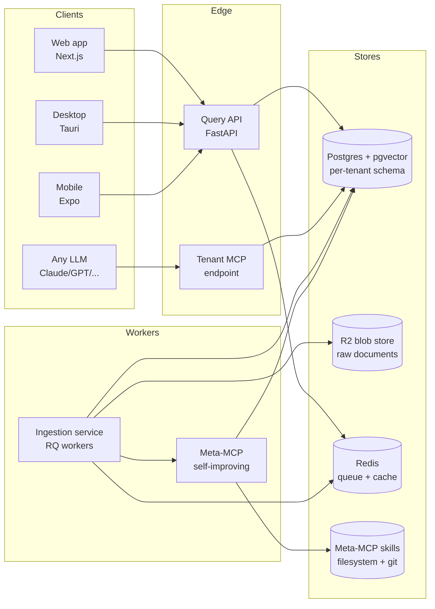
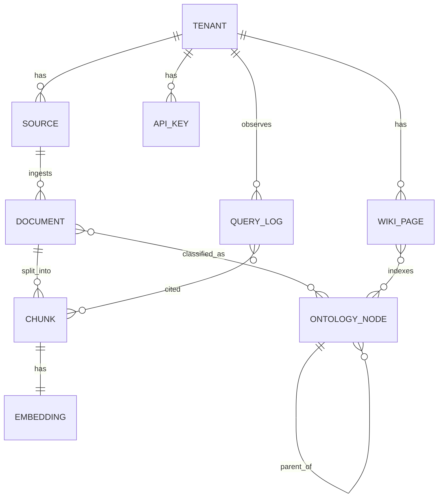
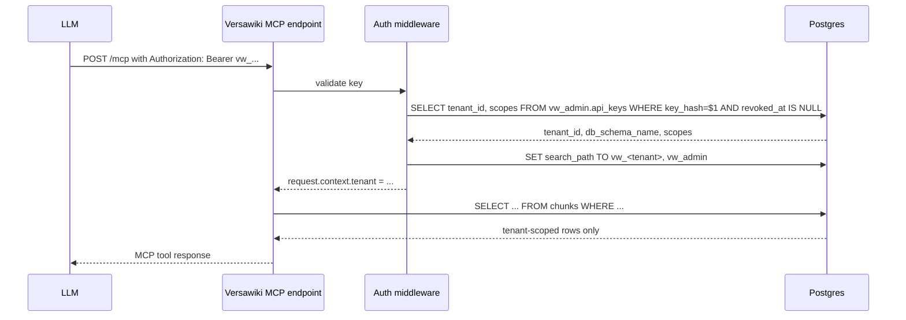
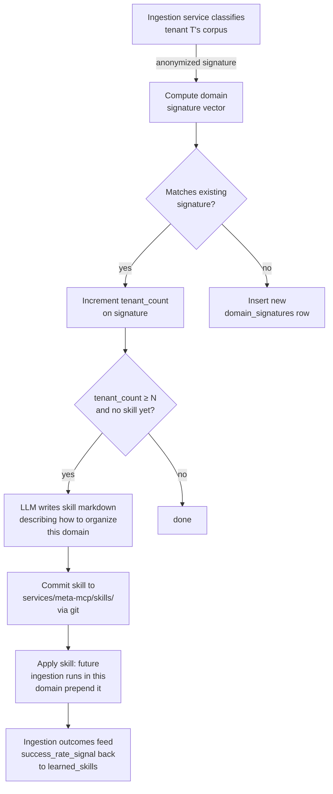

# Versawiki — v1 System Design

**Status:** Architect's draft. Reviewed-by: pending.

**Scope:** M1 (local-folder ingestion, headless query) with the shape of M2 (web UI, Drive connector) and M7 (meta-MCP cross-customer learning) already accounted for so we don't paint ourselves into a corner.

---

## 1. Service decomposition

We start with **five logical services**. In M1, three of them run in one Python process (modular monolith) and split out as scale demands.



### 1.1 Ingestion service (`services/ingestion/`)

Walks a source (local folder in M1; Drive/OneDrive/etc. later), fetches each document, hashes it, stores the blob in R2, chunks it, embeds chunks, classifies the document, places it in the tenant's ontology, and writes everything to Postgres. Runs as RQ workers. Driven by a single `ingest_source(tenant_id, source_id)` job that fans out one child job per document.

Key contract: connectors implement a `Connector` interface (`list()`, `fetch(uri) -> bytes`, `watch() -> Iterator[ChangeEvent]`). The rest of the pipeline is connector-agnostic.

### 1.2 Query API (`services/api/`)

FastAPI app. Serves the web/desktop/mobile clients. Routes:

- `POST /v1/tenants/{tenant_id}/query` — natural-language query, returns wiki pages + cited chunks
- `GET /v1/tenants/{tenant_id}/pages/{page_id}` — render a wiki page
- `GET /v1/tenants/{tenant_id}/ontology` — return the ontology tree for UI navigation
- `POST /v1/tenants/{tenant_id}/sources` — register a new ingestion source (M2+)
- `GET /v1/tenants/{tenant_id}/sources/{source_id}/status` — ingestion progress
- Admin endpoints under `/v1/admin/...` for tenant + API-key management

All routes require a tenant-scoped API key (header `Authorization: Bearer vw_<key>`). See section 4.

### 1.3 Per-tenant MCP endpoint (`services/api/mcp/`)

A single FastAPI subapp implementing the MCP-over-HTTP transport. Tenant resolution is by API key: each customer gets a unique URL like `https://mcp.versawiki.io/t/<tenant_slug>/mcp` (or, more honestly, a single endpoint `https://mcp.versawiki.io/mcp` where the API key resolves the tenant). Tools exposed to the LLM:

- `search(query, k=8, filters?)` — hybrid vector + keyword + ontology-filtered search
- `read_page(page_id)` — fetch a rendered wiki page (token-cheap; pre-summarized)
- `read_chunk(chunk_id)` — fetch a raw chunk with citation back to source URI
- `list_ontology(node_id?)` — browse the tenant's induced ontology
- `recent_queries(window?)` — what the human has been asking (informs the LLM's grounding) — opt-in per tenant

Why this list: an LLM agent's job at query time is to *find* the right context cheaply, then *fetch* only what it needs. `search` + `read_*` mirrors that pattern. We do not expose write tools in v1.

### 1.4 Meta-MCP (`services/meta-mcp/`)

The self-improving layer. Two responsibilities, both internal (no customer-facing endpoint in v1):

1. **Observe ingestion.** Subscribes to events from the ingestion service: "tenant X's corpus looks like {engineering project docs, legal matter, ...}", "the classifier was uncertain on these document kinds", "this ontology pattern repeats across tenants in domain Y." Builds a domain-level model.
2. **Write skills to itself.** When the meta-MCP recognizes a repeated pattern across N tenants (N ≥ 3, to be tuned), it writes a markdown skill file to `services/meta-mcp/skills/<domain>/<skill-name>.md` describing how to classify, ontology-shape, and chunk that domain's documents. Future ingestion runs in that domain consume the skill via a system-prompt prepend.

Storage of the meta-MCP's learnings is **completely separated** from any customer's content. Only embeddings of *anonymized structural features* (ontology shapes, document-type distributions, query-pattern shapes) ever cross the tenant boundary into the meta layer. Raw text never does.

This is the most novel part of versawiki and has the highest reversibility cost if we get its data flow wrong — see `notes/architect.md` for the open question to Josh.

### 1.5 Clients (`apps/web/`, `apps/desktop/`, `apps/mobile/`)

- Web: Next.js, talks to Query API. Hosts the ingestion-setup wizard (M2).
- Desktop: Tauri wrapper of the web bundle + an embedded local ingestion worker (M3) so users can ingest a folder without the bytes ever leaving their machine.
- Mobile: Expo, read + chat only (M5).

---

## 2. Data model sketch

Postgres, one **schema per tenant** (see section 4 for why). Within a tenant schema:



Tables (abbreviated columns; full DDL belongs in a Backend ticket):

- **`tenants`** (lives in the **shared `vw_admin` schema**, not in tenant schemas): `id`, `slug`, `display_name`, `db_schema_name`, `plan`, `created_at`.
- **`api_keys`** (shared schema): `id`, `tenant_id`, `key_hash`, `scopes` (jsonb: `["query"]`, `["query","admin"]`, etc.), `created_at`, `last_used_at`, `revoked_at`.
- **`sources`** (per-tenant): `id`, `kind` (`local_folder` | `gdrive` | `onedrive` | ...), `config` (jsonb — path or OAuth-token-ref), `status`, `last_synced_at`.
- **`documents`** (per-tenant): `id`, `source_id`, `source_uri`, `content_hash` (sha256), `blob_key` (R2), `mime_type`, `title`, `discovered_at`, `last_modified_at`, `deleted_at`.
- **`chunks`** (per-tenant): `id`, `document_id`, `ordinal`, `text`, `token_count`, `embedding vector(1024)` (HNSW indexed), `metadata` (jsonb).
- **`ontology_nodes`** (per-tenant): `id`, `parent_id`, `label`, `kind` (`category` | `entity` | `topic`), `embedding vector(1024)`, `confidence`, `source` (`induced` | `meta-skill` | `human`).
- **`document_ontology`** (per-tenant join): `document_id`, `ontology_node_id`, `confidence`, `assigned_by`.
- **`wiki_pages`** (per-tenant): `id`, `slug`, `title`, `body_md`, `body_html`, `primary_ontology_node_id`, `last_built_at`. Generated artifact; cheap to rebuild.
- **`query_log`** (per-tenant): `id`, `caller_kind` (`human` | `mcp`), `api_key_id`, `query_text`, `query_embedding vector(1024)`, `result_chunk_ids` (jsonb), `latency_ms`, `created_at`. Feeds the re-indexing loop.

### Meta-MCP layer (lives in a separate database)

- **`domain_signatures`**: `id`, `signature_vector vector(1024)`, `summary` (md), `tenant_count`, `last_seen_at`.
- **`learned_skills`**: `id`, `domain_signature_id`, `skill_path` (filesystem ref), `applied_count`, `success_rate_signal`.

No row in either table ever references a tenant id or contains tenant content. The signature vectors are computed from *aggregate structural features* (ontology depth, document-type histogram, query-shape histogram), not from content.

---

## 3. Wiki page generation

A wiki page is a derived artifact, not a source-of-truth row. Pages are built by a "page-builder" job that picks a `WIKI_PAGE` row marked stale (or new) and:

1. Loads the ontology node it indexes.
2. Pulls the top-N chunks under that subtree (by recency + centrality + recent-query relevance).
3. Asks an LLM to synthesize a structured markdown page with citations to chunk IDs.
4. Stores `body_md`, `body_html`, `last_built_at`.

Triggers for staleness:
- Document add/change/delete under the ontology subtree
- Ontology node moved or renamed
- A query pattern crossing a threshold ("people keep asking about X under this node and the page doesn't cover X")

That last trigger is the **query-driven re-indexing** loop from the README; it's a periodic job that reads `query_log`, clusters recent queries by ontology subtree, and marks pages stale where coverage gaps exist.

---

## 4. Auth and tenant isolation

### 4.1 The pick — schema-per-tenant inside a shared Postgres instance, with optional dedicated DB for enterprise

**Why schema-per-tenant rather than row-level isolation:**

- *Blast radius.* A bug in a WHERE clause on a row-level model can leak across tenants. With a schema-per-tenant model, the connection's `search_path` is set from the validated API key at the start of every request, and a missed filter returns an empty result instead of someone else's data.
- *Backup, export, delete.* A customer asking "give me my data" or "delete everything" is `pg_dump -n vw_acme` or `DROP SCHEMA vw_acme CASCADE`. Cheap and unambiguous.
- *pgvector index sizing.* HNSW indexes are per-table; per-tenant tables keep them small and recall high.
- *Cost.* Single Postgres instance hosts hundreds of small tenants; only enterprise tenants get their own DB (or Neon project).

**Why not full DB-per-tenant from day one:** Cost and ops overhead — connection pooling, migration fanout, monitoring all multiply. We pay that cost only for tenants who require it (and bill accordingly).

**Why not pure row-level (RLS-only):** RLS is correct in theory but in practice a single migration that forgets `USING (tenant_id = current_tenant())` can be catastrophic. The blast radius argument wins.

### 4.2 Request flow



### 4.3 API keys

- Keys look like `vw_live_<32-byte base62>` (or `vw_test_...` for sandboxes). Stored only as SHA-256 hashes; we never read the raw key after issuance.
- Scopes: `query` (default, MCP + read endpoints), `admin` (tenant management), `ingest` (trigger source syncs).
- Per-key rate limits in Redis (token bucket; default 60 rpm for query, 5 rpm for ingest).
- Rotation: a tenant can issue and revoke independently. Revocation is instant (cached in Redis with 30-second TTL).

### 4.4 Per-tenant DB users

Each tenant gets a Postgres role `vw_role_<tenant>` with USAGE only on its own schema. The API process holds a connection pool keyed by tenant; we `SET ROLE` at request start. This is belt-and-braces atop the schema isolation: a SQL injection that escapes a WHERE clause still can't read another tenant's schema because the role can't see it.

---

## 5. The MCP-endpoint shape (what the LLM actually hits)

We implement MCP over HTTP (streamable transport). One endpoint per tenant, served by the same FastAPI app:

```
POST https://mcp.versawiki.io/mcp
Authorization: Bearer vw_live_<key>
Content-Type: application/json
```

The endpoint advertises the tools listed in §1.3. Tool descriptions are dynamically tuned per tenant — if the meta-MCP has learned that this tenant's domain benefits from a `find_by_reference` tool (as the `project-docs-*` MCPs already have), it appears on that tenant's endpoint and not on others'.

Why per-tenant tool surfaces matter: an LLM agent picks tools by their descriptions. A generic `search` description performs worse than "search this customer's solar-project documents (SLDs, civil drawings, RFIs, ...)" for that customer. The meta-MCP's job is to keep these descriptions sharp.

### Token budget discipline

Every tool response is sized. `read_page` returns pre-summarized markdown (~1–2k tokens) by default with a `full=true` escape hatch. `search` returns titles + chunk IDs + snippets, not full bodies. The contract: an LLM agent should be able to get useful context for a typical question in under 2k tokens.

---

## 6. How the meta-MCP writes skills back to itself



**Concretely:**

1. After an ingestion run, the ingestion service emits a `DomainObservation` to the meta-MCP: anonymized counts (e.g., "47 PDFs classified as engineering drawings, 12 as RFIs, ontology depth 4, top query shapes: ['find X by sheet number', 'list pending RFIs']").
2. Meta-MCP embeds this observation as a `signature_vector` and either matches an existing `domain_signatures` row (cosine ≥ 0.92, tunable) or inserts a new one.
3. When a signature reaches `tenant_count ≥ N` (start N=3) and has no associated `learned_skills` row, the meta-MCP triggers a "draft skill" job. That job uses an LLM with the aggregated structural patterns (still no content) to write a markdown skill describing the organizational shape — what the ontology should look like, how to chunk these documents, which custom MCP tools help.
4. The skill is written to `services/meta-mcp/skills/<domain-slug>/<skill-name>.md` and committed to git via the same git-dir-split mechanism the team already uses (clean audit trail; reversible).
5. Future ingestion runs in matching domains include the skill text in the classifier's and ontology-builder's system prompts. Outcomes (classifier confidence, time-to-first-good-page, human override rate) flow back as `success_rate_signal` on `learned_skills`, so the system can weight skills by how well they work.

**Tenant content never enters this loop.** A tenant can opt out of contributing structural signatures entirely; they still consume the shared skills.

---

## 7. What v1 deliberately omits

- **Real-time sync** (file watchers, webhook-driven re-ingest). Initial M1 is poll-and-walk. M2 adds Drive change-feeds.
- **Multi-user-per-tenant** UI flows. M1 ships a single API key per tenant; team accounts are a later concern.
- **Cross-tenant search** of any kind. Even for the meta-MCP, we never federate content.
- **Inline edit of wiki pages.** Wiki pages are derived; v1 treats them as read-only outputs. Human override of ontology nodes is in scope (it's an input signal); page editing is not.
- **A graph store** for the ontology. Postgres adjacency rows are fine until we have evidence otherwise.

---

## 8. Open architectural calls flagged for Josh

These are flagged in `notes/architect.md` and not yet decided here. Each carries day-or-two rework risk if we pick wrong:

1. **The meta-MCP's data-flow boundary.** Do we promise customers that *zero* bytes derived from their content cross into the meta layer (even embeddings of ontology labels)? Or only that *no raw text* crosses? The looser promise gets us better cross-customer learning; the stricter promise is easier to explain to enterprise security reviewers.
2. **MCP transport.** MCP-over-HTTP (streamable) vs. WebSocket vs. SSE. Pick before any code is written; switching later means client coordination.
3. **Schema-per-tenant vs DB-per-tenant default.** I've picked schema-per-tenant as the default; enterprise tenants escalate to dedicated DBs. Confirm the default — flipping it later means a real migration.
